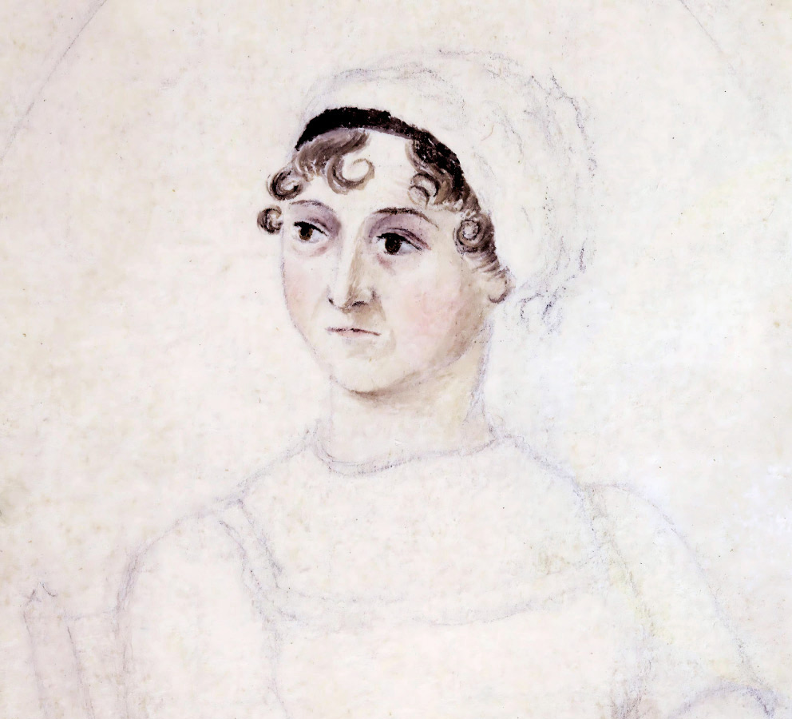

# # 📚 Universo Jane Austen

  

---

## 🎯 Contexto e Objetivos

Este projeto foi desenvolvido como parte do desafio da DIO utilizando o NotebookLM como ferramenta de aprendizagem ativa. O tema escolhido foi Jane Austen, uma das escritoras mais importantes da literatura inglesa.

O objetivo deste caderno temático é explorar sua vida, suas principais obras, as características de sua escrita e os temas recorrentes presentes em seus romances, utilizando inteligência artificial para organizar informações e aprofundar o conhecimento sobre a autora.

### Objetivos Específicos

* Conhecer a trajetória de Jane Austen.
* Compreender o contexto histórico em que viveu.
* Identificar as principais características de sua escrita.
* Analisar os temas mais frequentes em suas obras.
* Utilizar o NotebookLM como ferramenta de estudo e pesquisa.

---

# 📖 Curadoria de Fontes

As seguintes fontes foram utilizadas para construção deste caderno temático:

1. https://janeausten.co.uk/

2. https://pt.wikipedia.org/wiki/Jane_Austen

3. https://www.bl.uk/stories/blogs/posts/jane-austen-at-250

4. https://janeaustenbrasil.com.br/

5. https://jasna.org/

6. https://www.gutenberg.org/ebooks/author/68

7. https://www.scielo.br/j/ides/a/QrTBpGn3NxZfxk68XkdnC7v/?lang=pt

---

# 🤖 Engenharia de Prompts e Cicatrizes

## Prompt 1

Quem foi Jane Austen? Faça um resumo de sua vida e contexto histórico.

### Principais descobertas

* Jane Austen nasceu em 1775 e faleceu em 1817.
* Publicou seus romances anonimamente.
* Viveu durante o período Georgiano e da Regência Britânica.
* Suas obras retratam a sociedade inglesa e a condição feminina da época.

### Dificuldades encontradas

A resposta foi bastante extensa, exigindo uma síntese das informações mais relevantes.

---

## Prompt 2

Quais são as principais características da escrita de Jane Austen?

### Principais descobertas

* Uso frequente de ironia e sátira.
* Forte crítica social.
* Linguagem simples e objetiva.
* Realismo e observação do cotidiano.
* Protagonistas femininas inteligentes e marcantes.

---

## Prompt 3

Liste as principais obras de Jane Austen e resuma cada uma em até cinco linhas.

### Principais descobertas

Foram identificadas as obras:

* Razão e Sensibilidade
* Orgulho e Preconceito
* Mansfield Park
* Emma
* A Abadia de Northanger
* Persuasão

---

## Prompt 4

Quais temas aparecem com mais frequência nos romances de Jane Austen?

### Principais descobertas

* Casamento
* Educação feminina
* Dependência econômica das mulheres
* Classes sociais
* Hierarquia social
* Dinheiro e status
* Vida cotidiana

---

## Prompt 5

Como funciona o mashup literário Orgulho e Preconceito e Zumbis?

### Principais descobertas

A obra mistura trechos originais de Jane Austen com elementos da cultura pop contemporânea, criando uma adaptação que combina romance clássico e terror.

---

# 📚 Miniguia de Estudo

## Quem foi Jane Austen?

Jane Austen foi uma romancista inglesa conhecida por retratar com ironia, inteligência e realismo a sociedade britânica do final do século XVIII e início do século XIX.

---

## Principais Características da Escrita

* Ironia
* Sátira
* Realismo
* Crítica social
* Linguagem acessível
* Narrativas centradas nas relações humanas

---

## Principais Obras

### Orgulho e Preconceito (1813)

Romance que acompanha Elizabeth Bennet e Mr. Darcy, abordando preconceitos sociais e relacionamentos.

### Razão e Sensibilidade (1811)

A história das irmãs Elinor e Marianne Dashwood, representando razão e emoção.

### Mansfield Park (1814)

Explora moralidade, família e desigualdade social.

### Emma (1815)

Relata os erros e aprendizados de Emma Woodhouse ao interferir na vida amorosa de outras pessoas.

### A Abadia de Northanger (1817)

Paródia dos romances góticos populares da época.

### Persuasão (1817)

Aborda amadurecimento, arrependimento e segundas oportunidades.

---
## 💖 Meus Livros Favoritos de Jane Austen

Durante a realização deste caderno temático, algumas obras se destacaram pelo impacto de suas histórias, personagens e reflexões sobre a sociedade.

  

### 📚 Favoritos

* **Orgulho e Preconceito** — Pela evolução do relacionamento entre Elizabeth Bennet e Mr. Darcy e pela crítica aos preconceitos sociais.
* **Persuasão** — Pela história emocionante de reencontro, amadurecimento e segundas chances.
* **Razão e Sensibilidade** — Pelo contraste entre razão e emoção representado pelas irmãs Dashwood.

Essas obras demonstram a habilidade de Jane Austen em criar personagens marcantes e temas que continuam atuais mesmo após mais de dois séculos.
---
# 📖 Glossário

**Ironia:** forma indireta de crítica muito utilizada por Austen.

**Sátira:** uso do humor para questionar costumes sociais.

**Realismo:** representação da vida cotidiana de maneira próxima da realidade.

**Regência Britânica:** período histórico inglês entre 1811 e 1820.

**Crítica Social:** análise das estruturas e comportamentos da sociedade.

---

# 🚀 Prompts Reutilizáveis

* Quem foi Jane Austen e qual sua importância para a literatura?
* Quais características definem a escrita de Jane Austen?
* Compare duas protagonistas de Jane Austen.
* Quais críticas sociais aparecem em Orgulho e Preconceito?
* Explique a importância do casamento nos romances da autora.
* Qual o legado literário de Jane Austen?

---

# ✅ Conclusão

A utilização do NotebookLM permitiu organizar informações, comparar fontes e aprofundar o estudo sobre Jane Austen. A pesquisa demonstrou que suas obras continuam relevantes por abordarem temas universais como amor, classe social, educação, independência feminina e relações humanas, mantendo sua influência na literatura e na cultura popular até os dias atuais.
